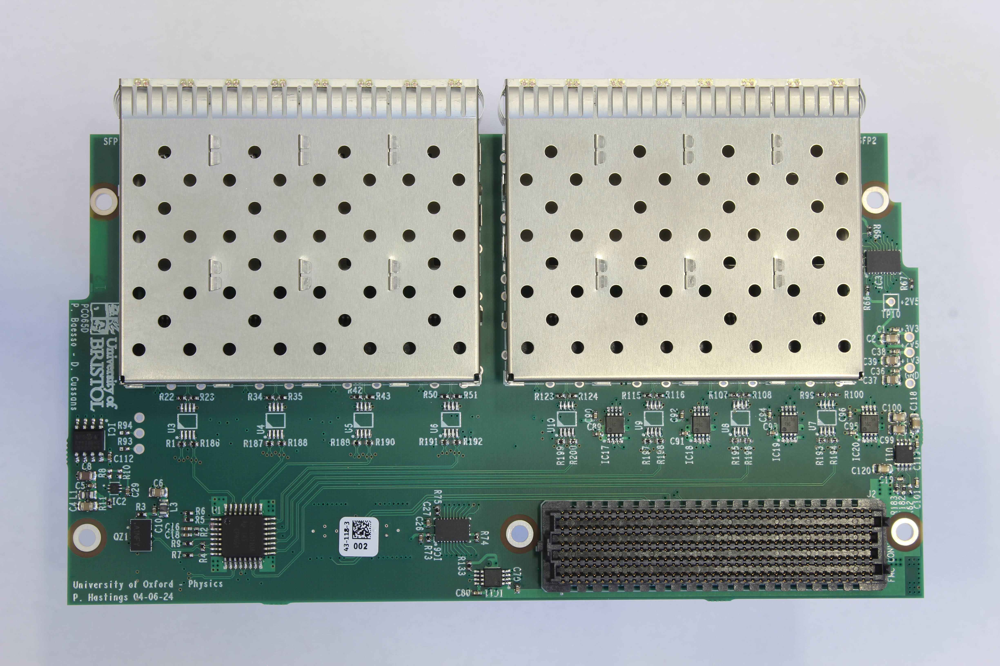
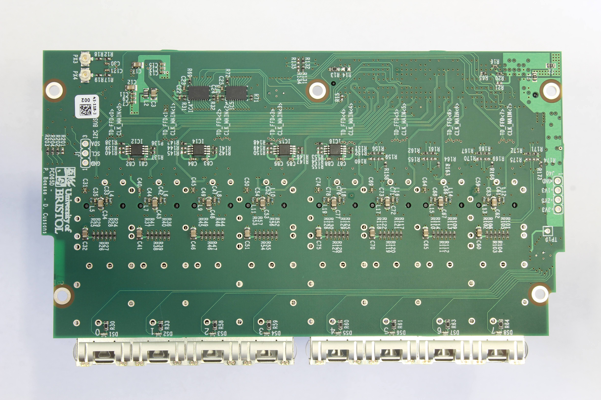

# uob-hep-pc065

Design Files for DUNE Timing System FIB (Fibre Interface Board)

The FIB is a double width FMC format board with LPC connector. 

It is designed to fit on the [Open Hardware AFC board][https://ohwr.org/projects/afc/]. We are grateful to [Altium][https://www.altium.com/] for sponsoring us through their Teams scheme, which facilitates our interactions with [Creotech][https://creotech.pl/] who make the AFC.

Designed using Cadence DE-HDL for schematic capture and Cadence Allegro PCB for layout

Versions:
* pc065a_toplevel.cpm - first version. Not used much. Schematic at https://github.com/uob-hep-cad/uob-hep-pc065/blob/master/www/Schematics/pc065b_toplevel_14may20.pdf
* pc065b_toplevel.cpm - second version. Used for tests with AFC v4. Schematic at https://github.com/uob-hep-cad/uob-hep-pc065/blob/master/www/Schematics/pc065b_toplevel_14may20.pdf
* pc065c_fibv2_toplevel.cpm -  pre-production prototype - bug in PCB. Re-spun
* pc065d_fibv2a_toplevel.cpm - Second pre-production prototype. Schematic at https://github.com/uob-hep-cad/uob-hep-pc065/blob/master/www/Schematics/pc065d_fibv2a_toplevel_4aug25.pdf

